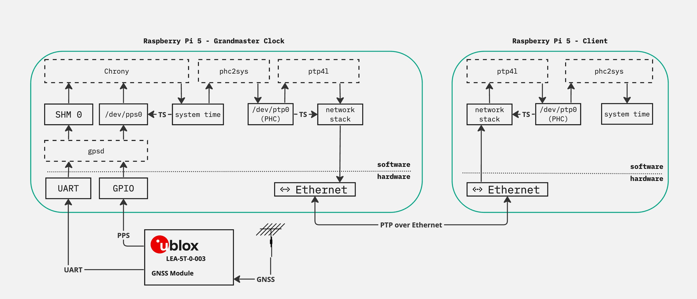
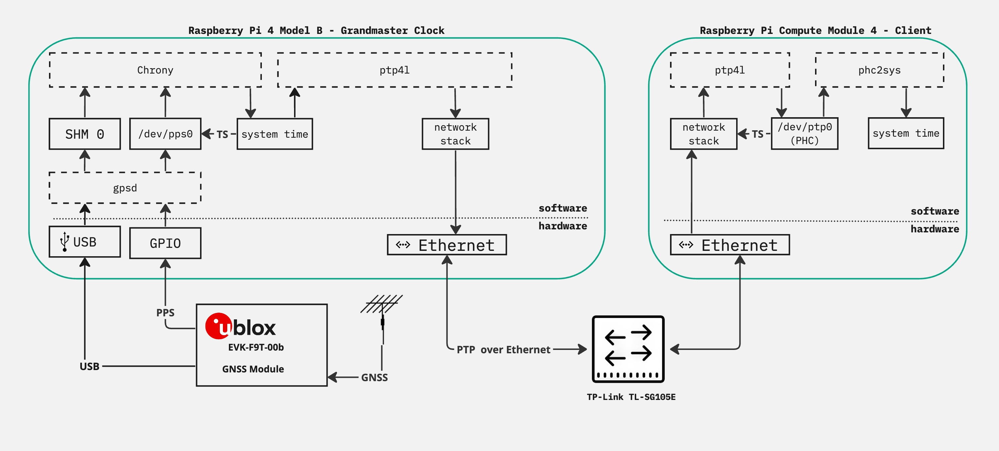

# Raspberry Pi 5 and Compute Module 4 GPS Grandmaster Development

This README offers a comprehensive overview of the project, encompassing setup guidelines, advanced performance tuning methods, and the repository's structural organization. 

## Project Summary

**Objective**  
The primary goal of this project is to investigate the feasibility and efficiency of using Raspberry Pi 5 or Compute Module 4, equipped with a u-blox GPS receiver, as a GPS Grandmaster for precise time synchronization. By leveraging optimization techniques from high-frequency trading (HFT), this study aims to enhance the accuracy and reliability of time synchronization, a critical component in financial trading and other time-sensitive applications.

**Background**  
In the realm of high-frequency trading, nanoseconds can represent significant financial gains or losses. Precise time synchronization across trading systems is crucial to maintain fairness and efficiency in the market. Traditional GPS Grandmaster solutions are often expensive and complex. This project explores a cost-effective, scalable alternative using widely available hardware, combined with advanced software optimizations, to meet or exceed current standards in time accuracy.

**Impact and Relevance**  
By achieving high levels of time synchronization precision, our solution has the potential to democratize access to technology essential for HFT and other sectors requiring synchronized time-stamping, such as telecommunications, distributed networks, and scientific research. The implications of this research extend beyond trading, offering insights and methodologies applicable to a wide range of industries.

**Approach**  
Our methodology involves:

1. Setting up Raspberry Pi units with u-blox GPS receivers.
2. Implementing and testing various software and hardware optimization techniques.
3. Comparing performance between baseline Raspberry Pi 5 and Compute Module 4, as well as optimized versions. 

Through systematic experimentation and analysis, we aim to identify the most effective combinations of hardware and software settings to achieve optimal time synchronization performance.

**Innovation**  
This project stands at the intersection of hardware engineering and financial technology, embodying a multidisciplinary approach to solving a real-world problem. By applying HFT optimization techniques to Raspberry Pi-based systems, we are pushing the boundaries of what is possible with consumer-grade electronics in professional and critical infrastructures.

**Future Work**  
The findings from this project will lay the groundwork for future research and development in affordable, accurate timekeeping technologies. We would like to compare the performance of GPS Grandmaster against traditional GPS Grandmaster Clocks under similar conditions. 

## Repository Organization

- `/src`: Source code directory containing scripts for all optimizations.
- `/docs`: Background research, documentation, including detailed setup guides, tuning techniques, data sheets, and project reports.
- `/tools`: Utility scripts for dependencies installation and configuration setup.
- `/tests`: Scripts for testing the performance of the time synchronization, including pre- and post-optimization results. 
- `/results`: Stores the output from any statistical analyses.
- `/data`: Raw data from test results. 
- `/imgs`:  Images used in any documentation, including README.md and project reports. 
- `README.md`: An overview of the project, setup instructions, and other essential information.

## Setups

### Local Systems

### Lab Systems

## Final Report

For more details, please review our [final_report.md](docs/final_report.md)
